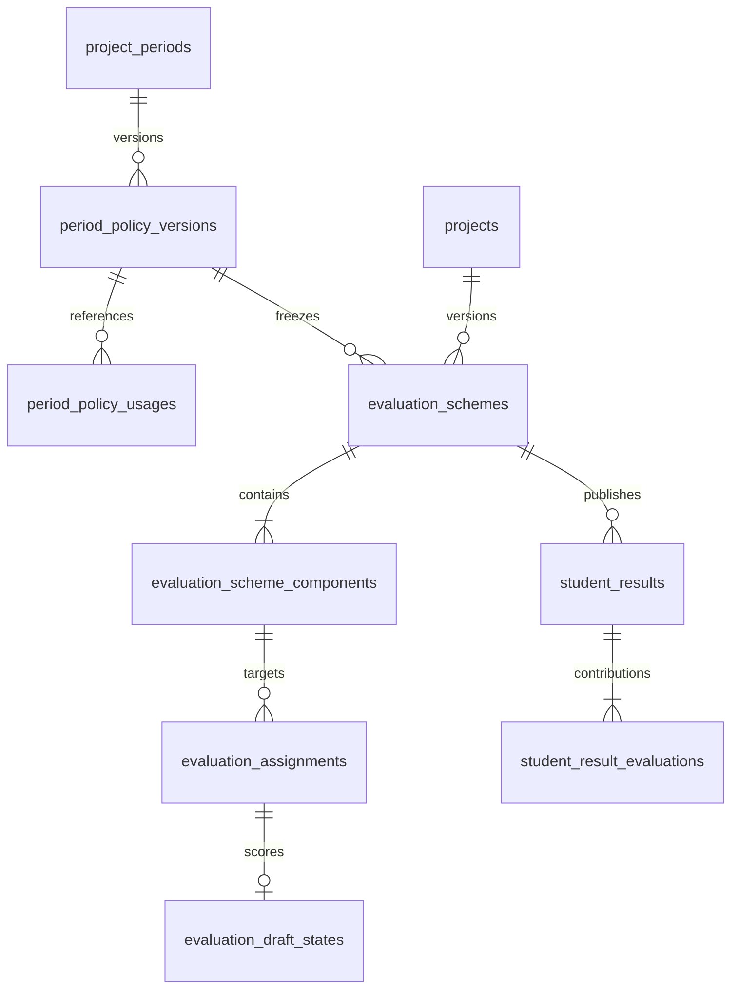

# Baseline v3 PR4: policy and evaluation

PR4 adds versioned project-period policy and scoped evaluation schemes. It is backend-only and database-first.

## Policy lifecycle

`GET /api/v1/project-periods/{id}/effective-policy?asOf=...` reads the UTC policy effective at the requested instant. Intervals are `[effectiveFrom, effectiveTo)`; the end instant is excluded. `GET /api/v1/project-periods/{id}/policy-versions` returns history including the current draft, so clients can recover its version/token after a disconnected request.

`PUT /api/v1/project-periods/{id}/policy` requires `expectedVersion` equal to the latest version, and an explicit operation:

1. `SUCCESSOR` creates a draft numbered after the latest published/locked version. There can be only one draft. This does not change the effective policy.
2. `UPDATE_DRAFT` replaces the draft fields/interval and requires its `concurrencyToken`.
3. `PUBLISH` requires the latest draft version/token. Publication is immediate; `effectiveFrom` must fall in the preceding five minutes, after the predecessor start, and `effectiveTo` must be in the future and within the period. The predecessor interval closes at this instant. Publication cannot backdate across an operation already referencing the predecessor.

Policy fields: `allowedProjectModes`, `allowedProposalSources`, `minTeamSize`, `maxTeamSize`, `minDistinctMajors`, `maxProjectsPerSupervisor`. Limits must be positive and feasible; modes/sources use the existing period allowlists. Null lists and invalid intervals return 400. Version/token conflicts, locked edits and retroactive publication return 409.

A published policy payload is immutable; references change its status to `LOCKED`. The first read/capture materializes existing period values without assigning invented references to historical operations. Submission snapshots, supervisor assignments, final submissions, evaluation schemes/assignments and finalized evaluations record `period_policy_usages` in their existing transactions. Supervisor replacement inherits the submitted policy, including after a successor is published. Legacy submission history without a recorded policy reference stays unknown.

Supervisor assignments additionally record `SUPERVISOR_CAPACITY` against the selection-period version actually used for quota checks. Discipline mentors and replacements retain the existing execution rule: the latest started active/closed selection period supplies capacity after the selection window ends. Registration/topic writes reject an expired published registration policy even when the period itself is still open. Publishing a successor closes an overlapping predecessor interval but never extends an already expired predecessor across a gap.

Existing period CRUD rejects policy field, date/type, rubric or milestone-template changes once version history exists. Name/description changes and explicit lifecycle close/archive remain available. Closing a period does not rewrite the policy version. Workflow window/state checks still apply. Publishing a successor updates current period fields and the version used by eligibility freshness checks; submitted snapshots are retained.

```json
{
  "expectedVersion": 1,
  "operation": "SUCCESSOR",
  "policy": {
    "allowedProjectModes": "SINGLE_MAJOR,INTERDISCIPLINARY",
    "allowedProposalSources": "PUBLISHED_TOPIC,STUDENT_PROPOSAL",
    "minTeamSize": 3,
    "maxTeamSize": 5,
    "minDistinctMajors": 1,
    "maxProjectsPerSupervisor": 5
  },
  "effectiveFrom": "2026-09-30T08:00:00Z",
  "effectiveTo": "2026-10-15T08:00:00Z"
}
```

## Evaluation scope

Scheme components use `COMMON`, `MAJOR_SPECIFIC`, or `INDIVIDUAL`. Project weights must total 100%. Student weights total 100% for each frozen major roster. Individual components never contribute to the project result. Evaluators are assigned against a published component and its policy snapshot. Records with `UNKNOWN` scope are legacy read-only data and cannot be finalized into a new result.

| Method | Route under `/api/v1` | Contract |
| --- | --- | --- |
| GET/POST | `/evaluation-schemes` | List by `projectId` / create draft |
| GET/PUT/DELETE | `/evaluation-schemes/{id}` | Read / replace draft with token / delete draft using query token |
| POST | `/evaluation-schemes/{id}/publish` | Publish validated draft with token |
| POST | `/evaluation-schemes/{id}/versions` | Clone published/retired scheme to a new draft |
| GET | `/projects/{projectId}/eligible-evaluators` | Existing period/pagination plus `componentId`, `scope`, `majorId`, `studentId` |
| POST | `/projects/{projectId}/evaluation-assignments` | Existing evaluator/period/type plus explicit component/scope/target |
| GET/POST | `/projects/{projectId}/students/{studentId}/result` | Read published result / publish from `confirmationToken` |
| GET | `/projects/{projectId}/students/{studentId}/result/preview` | Authorized staff/admin preview and blockers |

Scheme input includes `projectId`, `projectPeriodId`, `name`, `passThreshold`, `components` and a token on update. A component includes `name`, `scope`, `majorId`, `rubricId`, `projectWeightPercent`, `studentWeightPercent`, `requiredEvaluators`. COMMON has no major/student selector; other scopes require a frozen required major. An INDIVIDUAL assignment also requires `studentId` in the frozen verified roster. There are 1-20 equally weighted evaluators per component/target; unique active slots prevent duplicates. Weights support four decimal places; thresholds support two.

Configure/publish schemes while the project has a locked final package and an open evaluation window. Published components and the student/major/department roster are immutable. New versions do not replace a scheme after any scoped assignment references it. Revoke/reassign is supported before finalization; assignments cannot be retargeted. After the first finalized evaluation, required slots cannot be revoked. Existing create/save/finalize evaluation routes still score only rubric leaves and enforce evaluator, window and project state.

## Results

Project and student result previews hash the published scheme, policy, final-submission package, evaluator assignments, finalized evaluation snapshots, and roster. Publication requires the preview token and runs with audit and notification in the same transaction. Students can read only their own published result; staff/admin access remains department-scoped.

The stored calculation rule is `COMPONENT_EQUAL_EVALUATOR_MEAN_WEIGHTED_10_AWAY_2DP_V1`: compute each evaluator's existing rubric total on a 0-10 scale; take the arithmetic mean within its component; apply the configured target weight; round the final sum once to two decimals, away from zero. No missing score is zero-filled and no incomplete weight set is renormalized. All required assignments must have finalized snapshots for the same final package. Project publication also waits for mandatory student components because completing the project closes scoring. Student results may be published before or after the project result, before archive.

Example with two majors:

| Component | Project weight | Applicable student weight | Finalized scores |
| --- | ---: | ---: | --- |
| COMMON, two evaluators | 40% | 40% | 8 and 10, mean 9 |
| Software major | 30% | 40% for Software | 6 |
| Business major | 30% | 40% for Business | 4 |
| Individual Software | 0% | 20% for that student | 10 |
| Individual Business | 0% | 20% for that student | 2 |

Project = `9*0.4 + 6*0.3 + 4*0.3 = 6.60`; Software student = `9*0.4 + 6*0.4 + 10*0.2 = 8.00`; Business student = `9*0.4 + 4*0.4 + 2*0.2 = 5.60`. Changing a live student's major or rubric label after publication does not change these frozen inputs/results. Repeated publication returns 409; stored published results are never recalculated by a read.

## Authorization and compatibility

| Actor | Period policy | Scheme | Evaluation | Student result |
| --- | --- | --- | --- | --- |
| Admin | All periods | All academic scopes | Only with an eligible evaluator assignment | All project targets |
| Department Staff | Period explicitly scoped by its rubric to the actor's active department | Project in own academic scope; every edited component's rubric must be owned by that department | Manage own department assignments; no scoring for someone else | Preview/publish/read students in the frozen own department |
| Lecturer / mentor | Denied | Denied | Own active assignment only; SUPERVISOR type additionally requires current primary assignment | Denied unless also independently authorized as staff/admin |
| Student | Denied | Denied | Denied | Own published result only; full audit/roster snapshot is redacted |

Organization-wide periods without a department-scoping rubric are Admin-managed. Cross-department scheme changes/project publication require Admin, which confers no additional academic-review decision authority. Tokens and roles are checked against persisted data. Responses disable caching.

Payloads that omit component/scope cannot create a new evaluation assignment. `UNKNOWN` assignments/evaluations remain readable under existing authorization but cannot be scored/finalized. Published legacy ProjectResult JSON remains readable; no scope is inferred from lecturer/supervisor role. `/result-policy` reads retained history; PUT returns 409 directing clients to a published scheme. New project preview/publication uses the scheme exclusively. FE must supply the new assignment fields and configure a scheme before scoring; no frontend files are changed here.

## Database rollout

Apply `db/changes/20260930_add_policy_evaluation_schemes.sql` to an isolated E2E database first. The migration is additive and rerunnable. Production `AI_PMS` rollout is a separate controlled step; do not run mutation tests against it.

Database-first tables and relationships:



`db/schema.sql` includes evaluation prerequisite tables for fresh bootstrap; `db/e2e/migrations.json` adds the PR4 script after PR2/PR3. Mappings use the existing database-first extension-entity convention. No EF migrations are used. The old assignment unique index is replaced with distinct filtered indexes for legacy and scoped slots; unknown legacy values and published result JSON are preserved.

Use `AIPMS_TEST_SQL_CONNECTION` from the local secret store to run `dotnet test tests/AIPMS.IntegrationTests --filter FullyQualifiedName~PolicyEvaluation`; fixtures create and remove dedicated `AI_PMS_TEST_<guid>` databases. CI/test adapters do not send real email. Regression includes rubric/draft/finalization/result, final submission/archive, period CRUD, eligibility and supervisor governance. Run suites sequentially when using the shared SQL server to avoid excess fixture connections. Rollback is an application rollback preserving additive tables/history; do not delete results or infer replacement legacy scopes.

## Validation evidence (2026-09-30)

- API and integration-project build with warnings-as-errors: zero warnings/errors.
- Entire unit suite: 888 passed, zero skipped.
- SQL/integration regression and targeted reruns: 396 distinct cases passed on their latest run. The initial 317-case run identified one legacy assignment fixture; it was updated to publish a scheme before assignment and passed in the subsequent 125-case run. The final 13-case policy/Swagger run also passed after the expired-predecessor fix.
- Coverage includes migration reruns and preserved legacy results, concurrent policy/scheme/assignment writes, audit/notification rollback and replay, expired registration policy, supervisor capacity-policy references, two-department scoring and visibility, and upload-to-archive/reload.
- `db/schema.sql` includes the exact PR4 migration; staged whitespace checks pass. Production `AI_PMS` has not received this migration.
